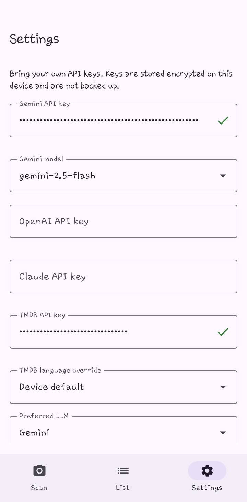
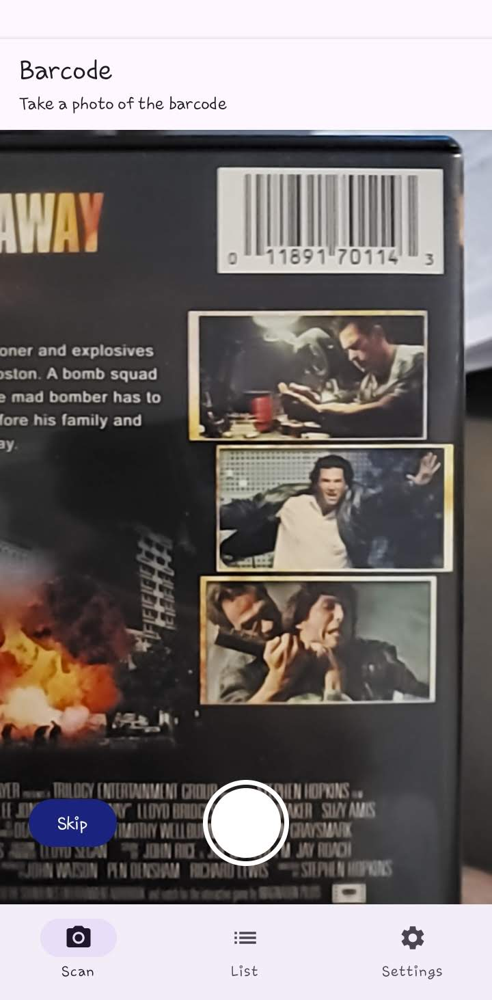
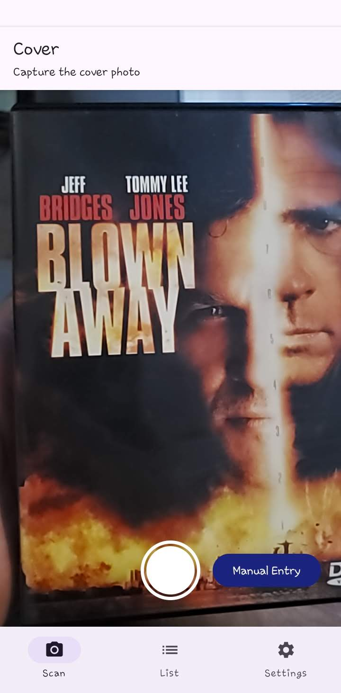
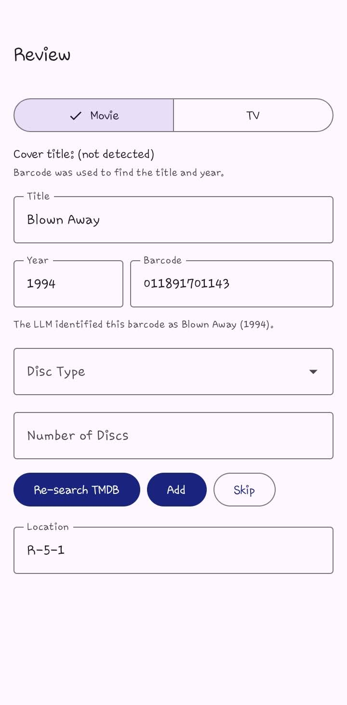
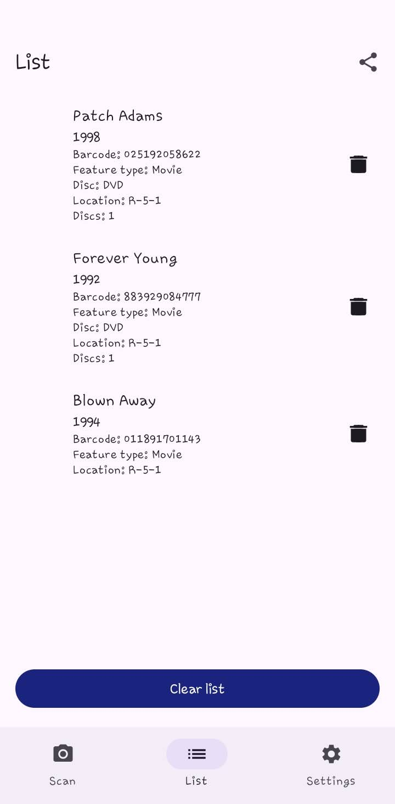
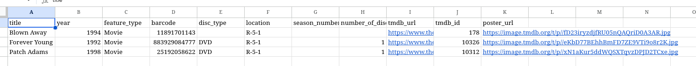

# Movie Scanner

Android app for scanning physical media barcodes and cover art, identifying titles with bring-your-own-key (BYOK) LLM providers, matching against TMDB, and maintaining an exportable catalog of movies and TV seasons.

## Screenshots

| Settings | Barcode capture |
| --- | --- |
|  |  |

| Cover capture | Review |
| --- | --- |
|  |  |

| List | Shared export |
| --- | --- |
|  |  |

## Requirements

- Android SDK (API 26+)
- JDK 17+
- API keys (user-provided in Settings):
  - At least one LLM key:
    - [Gemini API key](https://aistudio.google.com/apikey)
    - [OpenAI API key](https://platform.openai.com/api-keys)
    - [Claude API key](https://console.anthropic.com/)
  - [TMDB API key](https://developer.themoviedb.org/docs/getting-started)

Keys are stored in encrypted preferences on device and are not backed up. Scanning requires an internet connection.

## Build

```bash
export ANDROID_HOME=~/Android/Sdk
./gradlew assembleDebug
```

Debug APK: `app/build/outputs/apk/debug/app-debug.apk`

## Navigation

Bottom tabs: **Scan**, **List**, **Settings**.

Scan requires a valid TMDB key and at least one LLM key. Settings validates each key on save.

## Settings

- **Gemini**, **OpenAI**, and **Claude** API keys with per-field validation
- **Model pickers** for each configured LLM provider
- **TMDB** API key validation and optional **language override**
- **Preferred LLM** (Gemini, OpenAI, or Claude) with automatic fallback to other configured providers when the primary call fails

## Scan flow

1. **Barcode** (optional): camera opens on the barcode step. Take a photo; ML Kit and ZXing decode UPC/EAN/ISBN from the image. **Skip** moves on without a barcode.
2. **Cover** (required): after barcode capture or skip, the step switches to cover. Take a cover photo, or use **Manual Entry** to type title and year and skip cover recognition.
3. **Loading**: identifies the title and searches TMDB (see below).
4. **Review**: confirm or edit results, then **Add** / **Replace**, **Force Add** / **Force Replace**, or **Skip**.
5. Returns to the barcode step for the next item.

Failed barcode decode stays on the barcode step with an error (no silent skip to cover).

Barcodes are decoded on-device; LLMs are used to look up title and year from the decoded barcode (and barcode image when available), not to read the barcode itself.

## Loading / identification

When a barcode was captured:

1. **Finding with barcode** — LLM looks up title/year from the barcode (and barcode image when available).
2. **Searching movie in TMDB** — if TMDB returns matches, cover recognition is skipped and Review opens immediately.
3. If barcode lookup or TMDB search does not find a match, the app falls back to **Extracting title from cover image** and continues from there.

On the cover path, cover and barcode LLM calls may run in parallel when both are available. Cover title/year take priority; barcode fills gaps. TMDB search retries automatically up to 3 times.

Loading messages include **No internet connection** / **Offline scanning is not supported** when offline. Cover read failures offer **Retake cover**; TMDB failures offer retry.

## Review

- **Movie** / **TV** feature type toggle (remembered across scans)
- Summary of detected cover title and how the barcode was used for title/year
- Editable **title**, **season** (TV only, required), **year**, and **barcode** (barcode field auto-focuses when empty; newlines are stripped from barcode input)
- Note showing whether the LLM identified the barcode
- **Alt title** chip when barcode and cover disagree (tap to apply the suggested title and year shown beside it)
- TMDB result list with posters when there is more than one match; pick the correct match
- **Disc Type** (optional), **Number of Discs**, and **Location** (location is retained from the previous entry; clearing it clears the retained value)
- Action buttons: **Re-search TMDB**, **Add** / **Replace**, **Skip**, and **Force Add** / **Force Replace** when applicable
- **Add** or **Replace** when a TMDB match is selected and the item is already in the list (movies: matched by TMDB id; TV: matched by title and season)
- **Force Add** or **Force Replace** when no TMDB match is selected (title + year for movies; title + season for TV)
- **Skip** discards the scan; back gesture prompts to discard

When editing a duplicate already in the list, existing metadata (disc type, location, season, number of discs, and so on) is loaded from that entry before you confirm **Replace**.

## List

- Items persist in a local **Room** database; newest entries appear first
- Poster, title, year, barcode (ISBN/UPC label), and metadata (feature type, disc type, location, season, number of discs) per row
- **Unmatched** badge for force-added entries
- Swipe to delete an item, or tap the delete icon
- Tap a matched row to open its TMDB page in the browser; tap an unmatched row for details
- **Clear list** with confirmation
- Share icon exports CSV via the system share sheet

Empty list message: *No features yet. Click "Scan" to get started.*

## Export

- **List** tab: share icon
- **Loading** screen: overflow menu → Share list (while waiting on TMDB)

Default filename: `YYYYmmdd-HHMM_catalog.csv` (for example `20260607-1430_catalog.csv`).

CSV columns: `title`, `year`, `feature_type`, `barcode`, `disc_type`, `location`, `season_number`, `number_of_discs`, `tmdb_url`, `tmdb_id`, `poster_url`

All fields are quoted. `season_number` is populated for TV entries; other optional fields may be empty.
